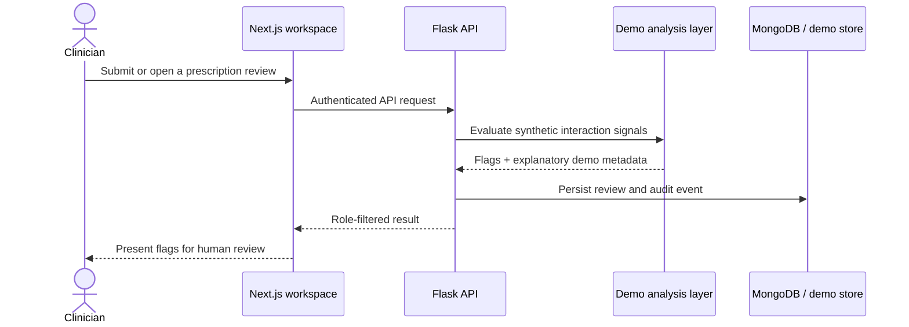
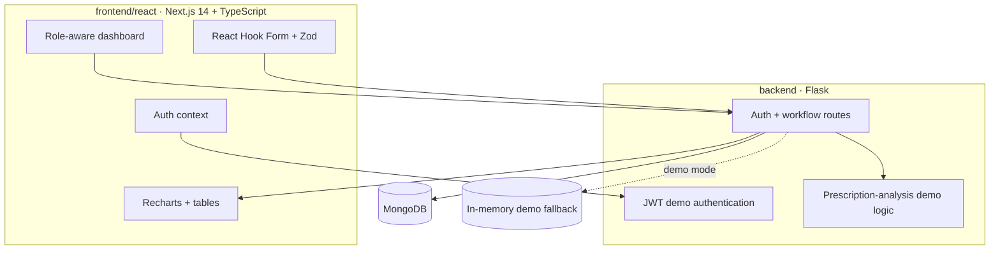

<div align="center">

# MediVerse Guardian X

### A safety-case workspace for healthcare AI demonstrations

[](#system-topology)
[](#system-topology)
[](LICENSE)

> Role-aware prescription review, interaction flags, audit events, and compliance-oriented dashboards—built as an engineering demonstration, not a clinical system.

</div>


<p align="center"><sub><strong>AI-GENERATED CONCEPT VISUAL.</strong> The repository has no public deployment or checked-in screenshot. This image illustrates the product direction and is not evidence of the running UI, real data, certification, or clinical validation.</sub></p>

## Safety boundary

> [!CAUTION]
> **Demonstration only.** MediVerse Guardian X must not diagnose, prescribe, override professional judgment, store real protected health information, or be represented as HIPAA-compliant, production-secure, blockchain-backed, or clinically validated without independent technical, legal, security, and clinical assessment. Drug-interaction output in a demo should be treated as synthetic and non-authoritative.

The project explores how different healthcare roles could collaborate around prescription workflows while preserving an inspectable trail of actions. It includes demo-mode accounts and fallback data so evaluators can study the interface without connecting a real clinical database.

## Who sees what

| Role | Intended demo surface | Must never imply |
|---|---|---|
| **Nurse** | Review queue, statuses, interaction flags | Authority to independently prescribe |
| **Doctor** | Upload/review prescriptions, comments, approvals | Clinically validated decision support |
| **Administrator** | Users, settings, analytics, audit/compliance views | Automatic regulatory certification |

## Review circuit



## System topology



### Frontend bench

Next.js 14, React 18, TypeScript, Tailwind CSS, Headless UI, Heroicons/Lucide, React Hook Form, Zod, Axios, SWR, TanStack Table, Recharts, Framer Motion, and Jest/Testing Library.

### Backend bench

Flask, Flask-CORS, PyMongo, Pydantic, PyJWT, bcrypt, Pillow, HTTPX, and environment-based configuration.

## Run the evaluation environment

### 1. Start the demo API

```bash
git clone https://github.com/QizarBilal/MediVerse-GuardianX.git
cd MediVerse-GuardianX/backend
python -m venv .venv
# Windows: .venv\Scripts\activate
# macOS/Linux: source .venv/bin/activate
pip install -r requirements.txt
python demo_app.py
```

The demo API listens on `http://localhost:5000`.

### 2. Start the interface

```bash
cd ../frontend/react
npm install
```

Create `frontend/react/.env.local`:

```dotenv
NEXT_PUBLIC_API_URL=http://localhost:5000/api
```

Then run:

```bash
npm run dev
```

Open `http://localhost:3000` and use only the credentials presented by the local demo UI or repository documentation. Never reuse demo passwords in a deployed environment.

## Engineering commands

| Location | Command | Purpose |
|---|---|---|
| `frontend/react` | `npm run dev` | Local Next.js workspace |
| `frontend/react` | `npm run build` | Production compilation |
| `frontend/react` | `npm run type-check` | TypeScript validation |
| `frontend/react` | `npm test` | Jest suite |
| `backend` | `python demo_app.py` | Synthetic-data demo API |
| `backend` | `python app.py` | Database-backed API path |

## Evidence required before real-world use

- [ ] Threat model, penetration test, dependency and secret scanning
- [ ] Encryption in transit/at rest plus documented key rotation
- [ ] Least-privilege authorization verified server-side for every route
- [ ] Immutable, privacy-aware audit design and retention policy
- [ ] Clinical terminology, drug data, alert logic, and false-positive evaluation
- [ ] Human factors, accessibility, downtime, and incident-response testing
- [ ] Applicable jurisdictional privacy/regulatory review
- [ ] Signed data-processing agreements and verified infrastructure controls

The presence of a feature label in code or UI is not proof that any item above has been satisfied.

## Data discipline

Use generated fixtures only. Do not commit patient identifiers, prescriptions, credentials, access tokens, database dumps, or real audit logs. Keep secrets in ignored environment files and rotate any value that has ever been published.

## Contributing

Open an issue describing the role, workflow, and safety impact before large changes. Pull requests should include focused tests, screenshots from a locally running build, and explicit notes about synthetic data. Avoid language that overstates compliance or clinical capability.

## License

Source code is available under the [MIT License](LICENSE). The license does not grant regulatory approval, clinical validation, compliance certification, or rights to third-party medical terminology and datasets.

<div align="center">

**A dashboard can support review. It cannot replace responsibility.**

</div>

# MediVerse Guardian X

A comprehensive Healthcare AI Compliance Platform with HIPAA monitoring, blockchain integration, and advanced analytics. MediVerse Guardian X provides role-based dashboards for healthcare professionals with AI-powered prescription analysis and compliance monitoring.

## 🚀 Features

- **Role-Based Access Control**: Separate dashboards for Nurses, Doctors, and Administrators
- **AI-Powered Analytics**: Intelligent prescription analysis and drug interaction detection
- **HIPAA Compliance Monitoring**: Real-time compliance tracking and reporting
- **Blockchain Integration**: Secure, immutable record keeping
- **Real-time Dashboard**: Live analytics and prescription management
- **Multi-theme Support**: Dark/Light theme toggle
- **Demo Mode**: Pre-configured demo accounts for testing

## 🏗️ Architecture

### Frontend
- **Framework**: Next.js 14 with TypeScript
- **Styling**: Tailwind CSS
- **State Management**: React Context API
- **UI Components**: Custom responsive components
- **Authentication**: Demo-based authentication system

### Backend
- **Framework**: Flask (Python)
- **Database**: MongoDB (with demo mode fallback)
- **Authentication**: JWT-based
- **CORS**: Configured for cross-origin requests

## 📋 Prerequisites

Before running this project, make sure you have the following installed:

- **Node.js** (v18.0.0 or higher)
- **npm** or **yarn**
- **Python** (v3.8 or higher)
- **pip** (Python package manager)
- **Git**

## 🛠️ Installation & Setup

### 1. Clone the Repository

```bash
git clone https://github.com/QizarBilal/MediVerse-GuardianX.git
cd MediVerse-GuardianX
```

### 2. Backend Setup

```bash
# Navigate to backend directory
cd backend

# Install Python dependencies
pip install -r requirements.txt

# Create environment file (optional)
cp .env.example .env

# Start the backend server (Demo Mode)
python demo_app.py
```

The backend will start on `http://localhost:5000`

**Alternative**: For full database mode:
```bash
python app.py
```

### 3. Frontend Setup

```bash
# Navigate to frontend directory
cd frontend/react

# Install Node.js dependencies
npm install

# Create environment file
echo "NEXT_PUBLIC_API_URL=http://localhost:5000/api" > .env.local

# Start the development server
npm run dev
```

The frontend will start on `http://localhost:3000`

## 🔑 Demo Credentials

The application comes with pre-configured demo accounts for testing different user roles:

### Nurse Account
- **Email**: `nurse@mediverse.com`
- **Password**: `nurse123`
- **Role**: Nurse
- **Permissions**: View prescriptions, update status, view interactions

### Doctor Account
- **Email**: `doctor@mediverse.com`
- **Password**: `doctor123`
- **Role**: Doctor
- **Permissions**: Upload prescriptions, approve/reject, view analytics, add comments

### Administrator Account
- **Email**: `admin@mediverse.com`
- **Password**: `admin123`
- **Role**: Administrator
- **Permissions**: Full access, user management, system settings, compliance monitoring

## 🚀 Quick Start

1. **Start Backend**:
   ```bash
   cd backend
   python demo_app.py
   ```

2. **Start Frontend** (in a new terminal):
   ```bash
   cd frontend/react
   npm run dev
   ```

3. **Access Application**:
   - Open `http://localhost:3000` in your browser
   - Click "Show Demo Credentials"
   - Select any demo account and click "Sign In"

## 📁 Project Structure

```
MediVerse-GuardianX/
├── backend/
│   ├── app.py                 # Main Flask application
│   ├── demo_app.py            # Demo mode Flask app
│   ├── requirements.txt       # Python dependencies
│   ├── config/
│   │   └── database.py        # Database configuration
│   ├── models/                # Data models
│   ├── routes/                # API routes
│   │   ├── auth.py           # Authentication routes
│   │   └── demo_auth.py      # Demo authentication
│   └── scripts/
│       └── seed_database.py   # Database seeding
├── frontend/
│   └── react/
│       ├── src/
│       │   ├── app/           # Next.js app router
│       │   ├── components/    # React components
│       │   │   ├── auth/      # Authentication components
│       │   │   ├── dashboard/ # Dashboard components
│       │   │   ├── layout/    # Layout components
│       │   │   └── ui/        # UI components
│       │   ├── contexts/      # React contexts
│       │   ├── lib/           # Utility libraries
│       │   └── config/        # Configuration files
│       ├── public/            # Static assets
│       ├── package.json       # Node.js dependencies
│       ├── tailwind.config.js # Tailwind configuration
│       └── tsconfig.json      # TypeScript configuration
└── README.md                  # This file
```

## 🎯 Usage

### Logging In
1. Navigate to `http://localhost:3000`
2. Click "Show Demo Credentials" to see available accounts
3. Select a demo account or manually enter credentials
4. Click "Sign In" to access the dashboard

### Role-Based Features

#### Nurse Dashboard
- View assigned prescriptions
- Update prescription status
- Check drug interactions
- View patient information

#### Doctor Dashboard
- Upload new prescriptions
- Review and approve prescriptions
- View analytics and reports
- Add clinical comments

#### Administrator Dashboard
- Manage users and permissions
- View system-wide analytics
- Monitor HIPAA compliance
- Configure system settings

### Theme Toggle
- Click the theme toggle button in the header to switch between light and dark modes
- Theme preference is saved automatically

## 🔧 Development

### Frontend Development
```bash
cd frontend/react
npm run dev      # Start development server
npm run build    # Build for production
npm run start    # Start production server
npm run lint     # Run ESLint
```

### Backend Development
```bash
cd backend
python demo_app.py    # Start demo server
python app.py         # Start full server with database
```

### Environment Variables

#### Frontend (.env.local)
```
NEXT_PUBLIC_API_URL=http://localhost:5000/api
```

#### Backend (.env)
```
FLASK_ENV=development
SECRET_KEY=your-secret-key-here
MONGODB_URI=mongodb://localhost:27017/mediverse
JWT_SECRET_KEY=your-jwt-secret-here
PORT=5000
```

## 🧪 Testing

### Demo Mode Testing
The application includes comprehensive demo data for testing all features without requiring a database setup.

### API Testing
Use the demo backend server for API testing:
```bash
# Test login endpoint
curl -X POST http://localhost:5000/api/auth/login \
  -H "Content-Type: application/json" \
  -d '{"email":"doctor@mediverse.com","password":"doctor123"}'
```

## 📦 Deployment

### Frontend Deployment (Vercel/Netlify)
1. Build the project: `npm run build`
2. Deploy the `frontend/react` directory
3. Set environment variables in your deployment platform

### Backend Deployment (Heroku/Railway)
1. Deploy the `backend` directory
2. Set environment variables
3. Configure the database connection

## 🤝 Contributing

1. Fork the repository
2. Create a feature branch: `git checkout -b feature-name`
3. Commit your changes: `git commit -am 'Add feature'`
4. Push to the branch: `git push origin feature-name`
5. Submit a pull request

## 📄 License

This project is licensed under the MIT License - see the [LICENSE](LICENSE) file for details.

## 🆘 Troubleshooting

### Common Issues

#### Frontend won't start
- Ensure Node.js v18+ is installed
- Delete `node_modules` and run `npm install` again
- Check if port 3000 is available

#### Backend won't start
- Ensure Python 3.8+ is installed
- Install dependencies: `pip install -r requirements.txt`
- Check if port 5000 is available

#### Login not working
- Make sure both frontend and backend servers are running
- Use the exact demo credentials provided
- Check browser console for errors

#### API connection errors
- Verify `.env.local` has correct API URL
- Ensure backend server is running on port 5000
- Check CORS configuration

### Getting Help
- Check the [Issues](https://github.com/QizarBilal/MediVerse-GuardianX/issues) page
- Create a new issue with detailed error information
- Include browser console logs and server logs

## 📞 Contact

- **Repository**: https://github.com/QizarBilal/MediVerse-GuardianX
- **Issues**: https://github.com/QizarBilal/MediVerse-GuardianX/issues

---

**MediVerse Guardian X** - Empowering Healthcare with AI-Driven Compliance and Analytics
